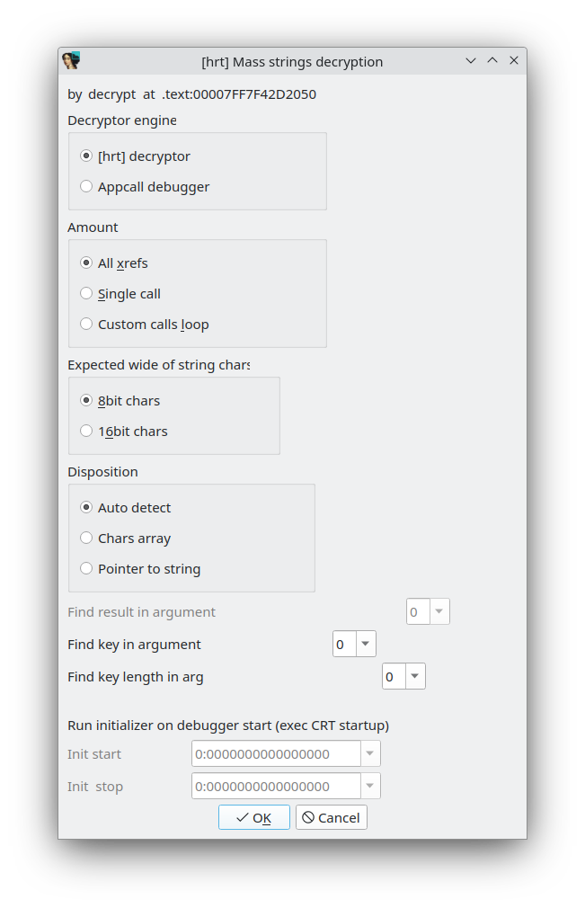
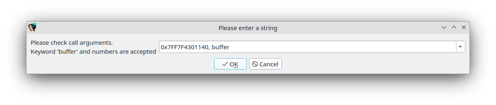
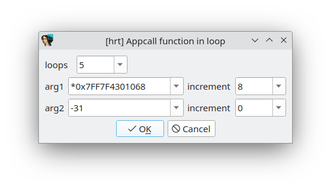
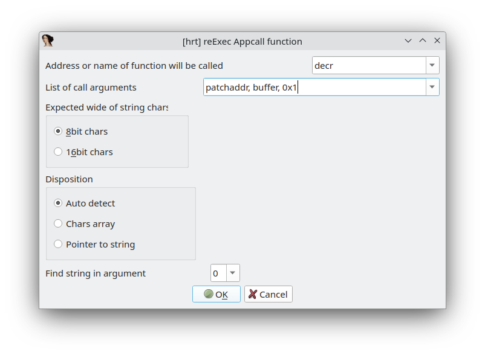
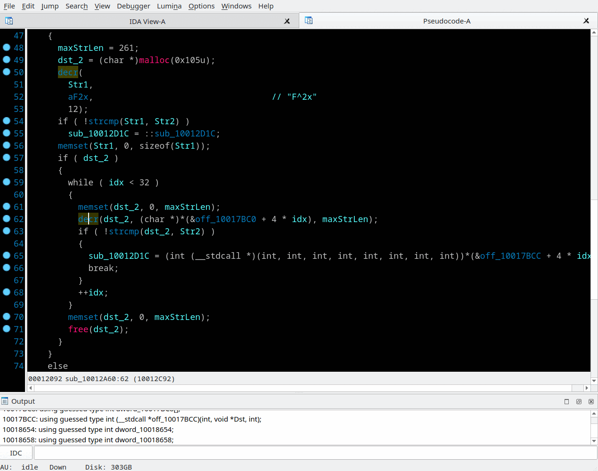

## Mass strings decryption
Context menu *"Mass strings decryption (A)"*, menu *"View/Open subview/Last mass-decr results"*

This feature is inspired by ideas of [Krypton plugin by Karthik Selvaraj](https://www.hex-rays.com/contests/2012/Krypton_2012_Hex-Rays_Contest.zip) that uses IDA's powerful [Appcall feature](https://hex-rays.com/wp-content/uploads/2019/12/debugging_appcall.pdf) - call functions inside the debugged program  
The main problem of Krypton - it can't deal with mixed registers/stack arguments because tries to analyze low level assembler code. This implementation takes everything from Hex-Rays generated pseudocode.  
Imagine following pseudocode:
```
    str = decrypt(178325499, &unk_B8012EB0);
```
  Where `str` is a pointer to decrypted string, `178325499` - is Key, `&unk_B8012EB0` - is a pointer to encrypted data. It doesn't matter how `decrypt` procedure does the job, it might be black-box for us. We only need to know how the encrypted data is entering into this proc and where we can find decryption results.
1. At first correct typeinfo of `decrypt` procedure. Press 'Y' or select *"Set item type"* from context menu and setup correct `decrypt` proc type.
2. Right click to `decrypt` call and select *"Mass strings decryption"*
3. Dialog box is appeared with bunch of options:
	* Decryptor engine
      - [hrt] decryptor  - useful for known (by the plugin) cipher, on following step you will be asked for use one of decryptors described in [Strings/data/const decryption](decr.md) section
      - Appcall debugger - currently selected IDA debugger be used to run `decrypt` procedure with found parameters.
	* Amount
      - All xrefs - all `decrypt` calls will be processed
      - Single call  - only `decrypt` call under the cursor will be processed. Check and confirm the call arguments on the next step.
      - Custom calls loop - `decrypt` will be called few times with custom arguments you will be asked on the next step.
	* Expected wide of string' chars - what kind of string `decrypt` should return. If `decrypt` might returns both types - run "Mass decryption" twice.
      - 8bit chars - one byte char size, zero terminated
      - 16bit chars - two bytes char size, zero terminated
	* Disposition - how `decrypt` returns results
      - Auto detect - usually works pretty well with rare exclusions
      - Chars array - fill given in argument buffer with decrypted string characters
      - Pointer to string - put pointer to string into an argument or return value
	* Find result in argument - serial number of argument (starting from 1) where the plugin will find the decrypted string. Specify zero for the returned value.
	* Find key in argument - please specify from which argument [hrt]-decryptor will takes an encryption key. Set zero if all calls uses the same key that is not transferred via arguments, then setup key in following step.
	* Find key length in arg - please specify from which argument [hrt]-decryptor will takes encryption key length. Set zero if not applicable.
	* Run initializer on debugger start (exec CRT startup) - `Imul` debugger can execute initialization code before calling `decrypt`. For example if `decrypt` internally uses calls like "`operator new`", C/C++ runtime libraries must be initialized before Appcalls. This option is not applicable for IDA's "Remote xxx debugger". You have to manually start debugger and step over runtime initialization before running *"Mass strings decryption"*.
      - Init start - usually EXE/DLL entrypoint address here. Set zero if runtime initialization is not necessary.
      - Init stop - some address where runtime initialization is completed. `main` or `DllMain` address usually good here. Set "`-1`" if you want to run initializer until first breakpoint occurred.
4. For "Single call" and "Custom calls loop" you will be ask for confirmation/override arguments settings. 
As arguments are accepted:
	* `"buffer"` keyword - 1KB buffer will be allocated and passed as an argument to `decrypt` proc call
	* `number` (dec/hex/oct/bits) - be passed as an argument to `decrypt` with size according `decrypt` arguments typeinfo
	* `*number` - number will be treated as de-referencing of pointer to pointer type value ie "`*(void**)(number)`".   
For example, imagine array of pointers to encrypted strings. You able decrypt all of them at once with "Custom calls loop" specifying `*array_address` as pointer to encrypted data, `pointer_size` as loop step increment and `array_size/pointer_size` as loops count.
5. Optionally, if "[hrt] decryptor" engine was selected, you will be asked for cipher and decryption related details. See details in [Strings/data/const decryption](decr.md) section.
6. Then, if "All xrefs" was selected, all `decrypt` calls arguments be collected by decompiling subroutines where `decrypt` is called. So, each `decrypt` call have to belong to correctly decompilable by Hex-Rays subroutine. Please look for warnings in the IDA's "Output window" if something went wrong.
7. Next, in case of "Appcall debugger" engine usage, the currently selected debugger is started. Watch for warnings and messages related to used debugger - there may be hints to solve problems. Check "Application" and "Input file" fields under "Debugger/Process options" menu. Try to change `decrypt` arguments/return type to `void*` or to `int`.
8. After debugger done calls of all requested decryptions the results window appeared. For "Single call" it is just a dialog box with decrypted string and buttons "Patch" and "Comment". For "All xrefs" and "Custom calls loop" there is window with list of Patch-Locations and decrypted strings or errors. Right click in this window offers following options:
	* *"jump to disasm (D)"* - to see in disassembly where this string decryption is called.
	* *"jump to pseudocode (Enter/dbl-click)"* - to see in pseudocode where this string decryption is called.
	* "jump to patch location (J)" - to see where this string was taken in encrypted form and may be patched by decrypted string.
	* *"write comments (C)"* - set decrypted strings as a comment on "call decrypt" instruction
	* *"write patches (P)"* - writes decrypted strings at "patch locations"
	* *"write to file"*  - writes decrypted strings and "patch location addresses" to `<idb_name>.txt` file.  
	All three "write ..." options will write/comment/patch currently selected or all (if nothing was selected) lines were not marked red colour as error.
	* *"re-execute appcall with another proc"* - Imagine a case when `decrypt` procedure is inside a `wrapper` procedure that receives pointer to encrypted string as an argument but the decrypted string is used inside `wrapper` and does not returned in any way. So we can collect "patch locations" which actually are addresses of encrypted strings as first step. Obtain full of red lines decryptions results. And then select *"re-execute appcall with another proc"*.
  
In the appeared dialog set address or name of `decrypt` procedure. "List of call arguments" is in similar to "Single call" arguments format, with one new keyword introduced here. `"patchaddr"` keyword means argument value was collected on previous (`wrapper`) step. Other options was described above. So we can decrypt another portion of strings.

>📝 **Notes:**
> - At first try is recommended to check if "Single call" decryption works well.
> - If `decryptor` function is variadic (take a variable number of arguments and uses an ellipsis as the last parameter) it ts better to temporary convert it into a function with a fixed number of parameters to satisfy Appcall's  argument-parameter correlation. And then clear decompiler cache with menu *"Edit/Other/Clear cached decompilation results"*
> - If mass decryption results window was closed it can be reopened with menu  "View/Open subview/Last mass-decr results"
> - This feature was tested with "imul" emulator and IDA's "Remote Windows" debuggers only.

### Mass strings decryption with internal decryptor engine


### Custom Appcalls loop


### Re-exec Appcall

