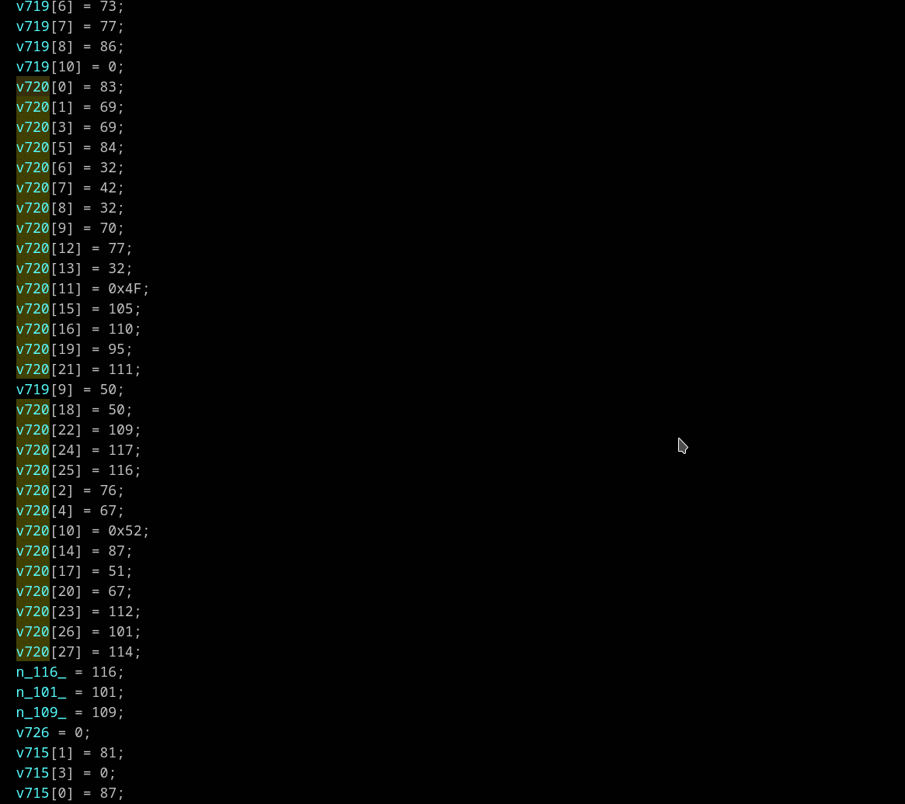

## Build array strings (optionally with decryption)
Context menu *"Build array string and decrypt (A)"*

In situation when string chars are assigned to array (it doesn't matter on stack or heap, in any order). Right click on first char assignment and select *"Build array string and decrypt (A)"*. Decryption like "`Add`" or "`Xor`" with key "`0`" may be used when string is not encrypted.
>📝 **Note:** Selecting the first assignment is necessary for distinguish different strings assignment to the same memory location.

