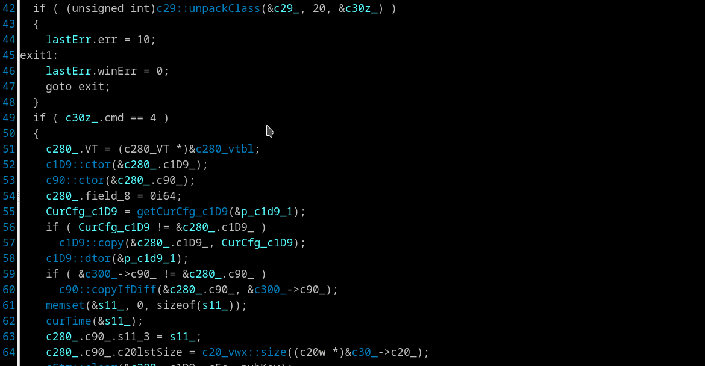

## Pseudocode auto-comments

### Address name
Sometimes during analysis you need to put comment with name of proc or global variable. But the proc may be renamed further. Just type the @0xaddress in the comment and the plugin dynamically resolve the address name insert it just before.

```
 // example of the address comment
 // @0x180002222 @0x180008888

 // be displayed with the plugin as
 // DllEntryPoint@0x180002222 CreateFileWrapper@0x180008888
```

### Indirect call targets
Indirect call including virtual calls are usually a big pain for researcher especially if there are more then one target proc. The plugin helps to keep all [visited indirect call targets](ijmp.md) before eyes if them more then one. Example:

```
 // these comments below are automatically displayed by the plugin
 // cCmd1__execCmd
 // cCmd2__forwardCmdToPeer
 // cCmd3__delCmd
 // cCmd4__sheduleDelayedCmd
 cCmd->cCmd1__execCmd((cCmd1 *)cCmd);
```

### Display strings in writable segment
Non constant strings placed in writable segment which Hex-Rays display as just a global variable are duplicated as comment.

### Pull up comments from disasm to pseudocode view
Researchers and 3rd party IDA plugins often write comments in the disassembly view. The plugin automatically duplicates these comments into pseudocode view. The comment have to be "repeatable" and don't begins with additional ';' symbol. IDA generated auto-comments are filtered out.


