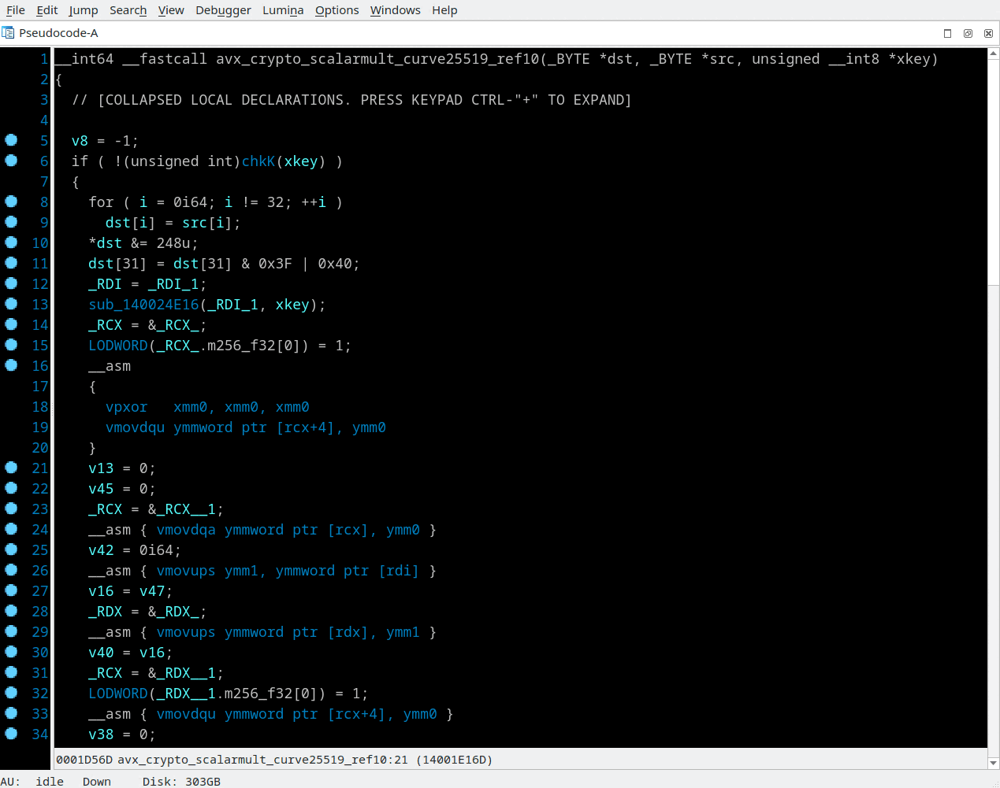

## AVX lifter
Context menu *"Enable AVX lifter"* and *"Disable AVX lifter"*

Original code of [AVX support for the Hex-Rays x64 Decompiler](https://github.com/gaasedelen/microavx) plugin has been rewritten from Python to C++ and a few more [AVX](https://en.wikipedia.org/wiki/Advanced_Vector_Extensions) instructions have been added.  
With enabled "AVX lifter" option some of AVX instructions have not been recognized by Hex-Rays decompiler are replaced by the plugin to corresponding [intrinsics](https://www.intel.com/content/www/us/en/docs/intrinsics-guide/index.html), some replaced to regular arithmetic microcode operations.

>📝 **Note:** This feature works with IDA 7.5 and later because of necessary for temporary registers allocations API (`alloc_kreg`) was appeared in this version.

