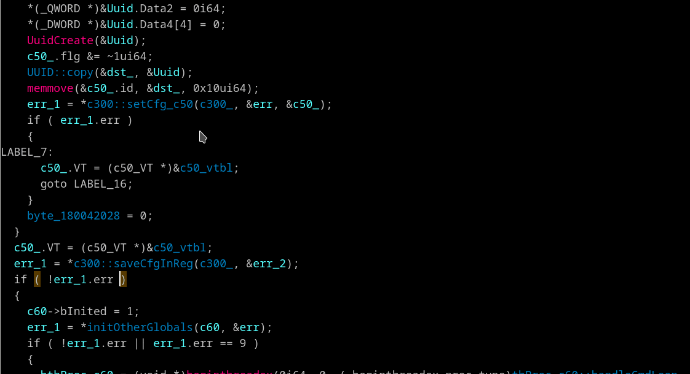

## Matching brace highlight.
[hexrays_hlight plugin by Milan Bohacek](https://hex-rays.com/contests/2016/hexlight/hexrays_hlight.py) rewritten on C++ and improved

Highlights matching curly brace in the pseudocode view and lets you jump from one brace to another by pressing "[" and "]" keys.

~~Highlights matching round brackets in the same line.~~
> ⚠️ Brackets higliting is appeared in IDA 7.4 - so I've turn off my round brackets processing for fresh IDA versions. Handling of round brackets still here then compiling with an older SDK

