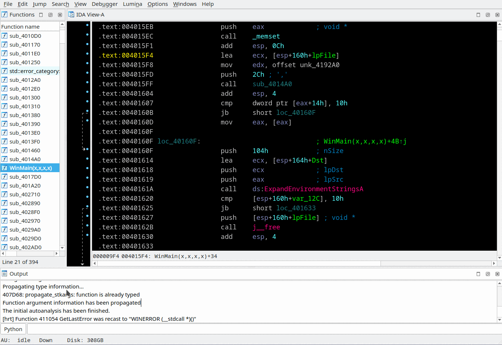

## COM helper
This feature implementation is inspired by "comhelper" plugin included into IDA Pro pack.

COM helper works automatically. At start reads `IDADIR/cfg/clsid.cfg` file and then watches data creation with types: `CLSID`, `IID`, `GUID` and `EFI_GUID`. For known GUIDs the plugin creates meaningful name and imports appropriate types from IDA type-libraries.  
During decompilation the plugin is looking for `CreateInstance`, `CoCreateInstance`, `CLRCreateInstance`, `CoGetClassObject` and `QueryInterface` calls and automatically setup typeinfo for requested interfaces.

> ⚠️ Provided together with IDA `IDADIR/cfg/clsid.cfg` file has a lot of wrong definitions. Please fix it by yourself: just delete `CLSID_` and `IID_` prefixes of typename.

