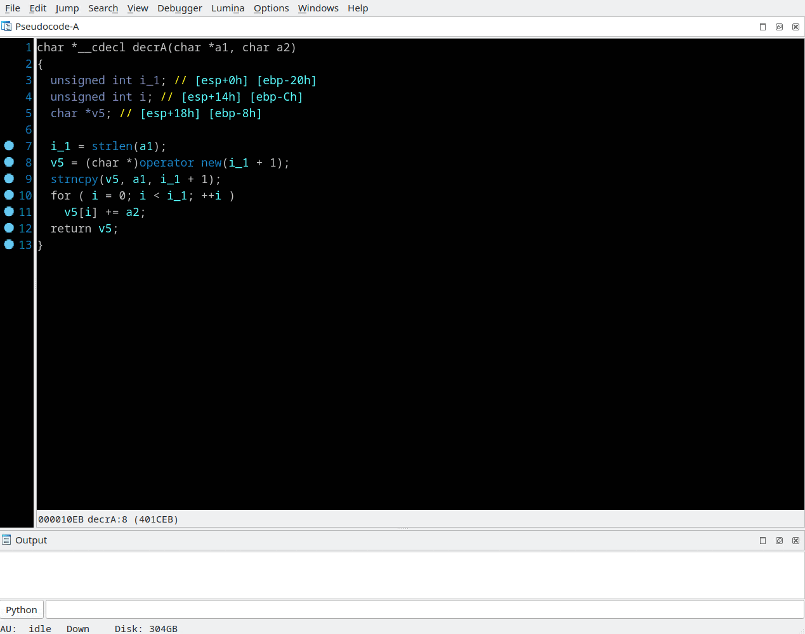

## Ctree graph
Menu *"View/Graphs/Show ctree graph"*

This thing may be helpful for Hex-Rays decompiler's plugin developers.  
When pseudocode window is active, select *"View/Graphs/Show ctree graph"* and IDA's WinGraph32 window appears with [Abstract Syntax Tree](https://en.wikipedia.org/wiki/Abstract_syntax_tree) of the decompiled procedure. The item lying under the keyboard cursor in pseudocode view will be highlighted in the graph.

