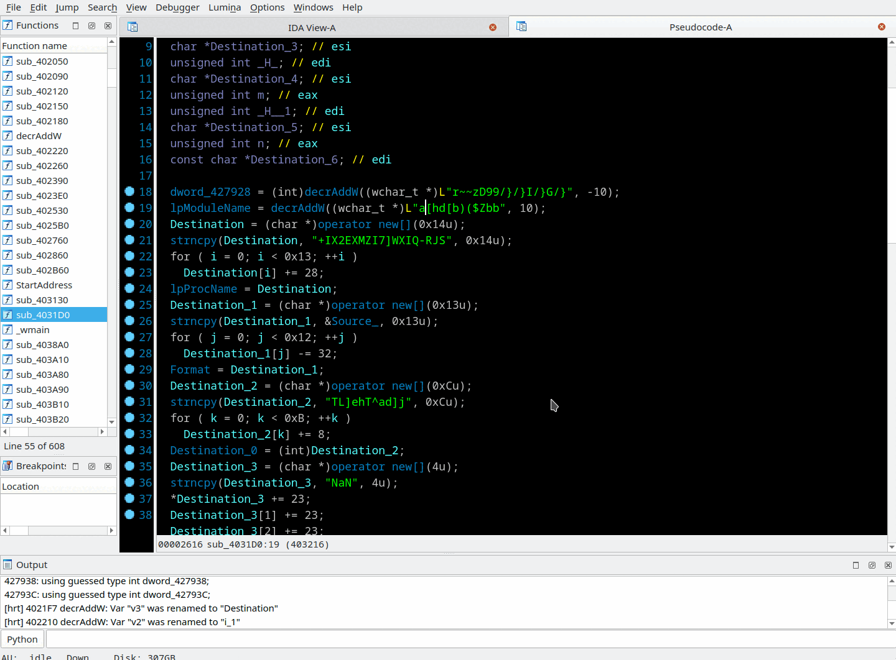
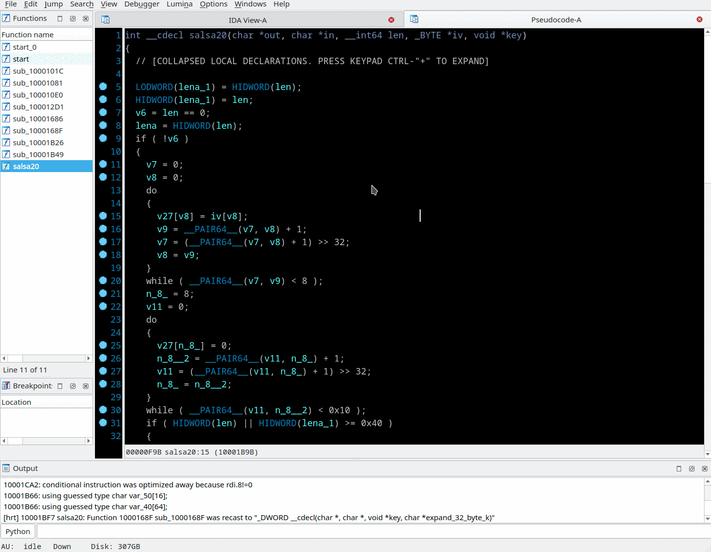
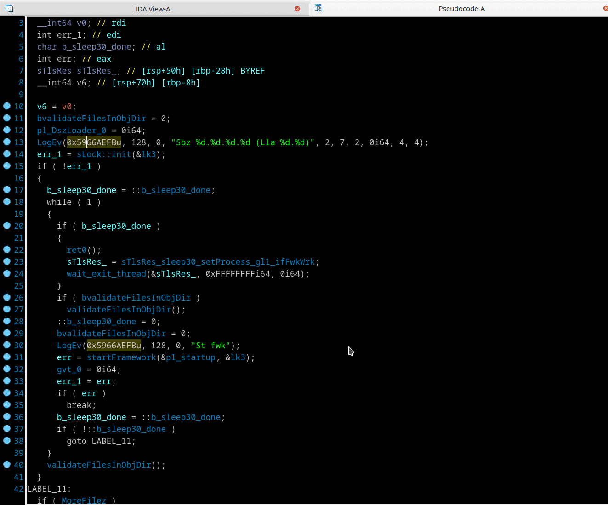

## Strings/data/const decryption
Context menu *"Decrypt string (D)"* or *"Decrypt imm const (D)"* in pseudocode view, *"Decrypt data (Shift-D)"* in disasm view.

Right click on string, global variable or constant value in pseudocode or  in disasm view and select "Decrypt ...". Select appropriate encryption algorithm and parameters in dialog box.

The following ciphers are available:
- `Ror/Add/Sub/Xor/Mul` every symbol of string with `Key`. `Byte, Word, Dword, Qword` item sizes are supported.
- `Xor` every byte of string with corresponding byte of `Key` string.
- [Simple substitution](https://en.wikipedia.org/wiki/Substitution_cipher#Simple_substitution)
- [RC4](https://en.wikipedia.org/wiki/RC4)*
- [Sosemanuk](https://en.wikipedia.org/wiki/SOSEMANUK)*
- [ChaCha20](https://en.wikipedia.org/wiki/Salsa20#ChaCha_variant)*
- [Salsa20](https://en.wikipedia.org/wiki/Salsa20)*
- [Tea](https://en.wikipedia.org/wiki/Tiny_Encryption_Algorithm)*
- [XTea](https://en.wikipedia.org/wiki/XTEA)*
- [AES](https://en.wikipedia.org/wiki/Advanced_Encryption_Standard)*
- [DES](https://en.wikipedia.org/wiki/Data_Encryption_Standard)*
- there are also placeholders in this list for your custom stream and block ciphers

(*) Statically linked open source library [Crypto++](https://www.cryptopp.com/) is used for these algorithms. So you may easily extend the available ciphers list.

Results of decryption be shown in "Output Window" in hex representation and as a string in dialog box that asks to patch string (if applicable) or set comment with decryption results

Notes:
- For ciphers that can work with different key length - the default key length is 128 bits (16 bytes) when key is specified by memory address. For Simple-Substitution the default key-length is 256 bytes.
- For [CBC](https://en.wikipedia.org/wiki/Block_cipher_mode_of_operation#CBC) mode of ciphers, zeroes filled IV is assumed if IV value is not specified.
- Hover mouse above "Key", "IV" or "Cnt" field - hint is appeared.
- The plugin uses various hints to guess decryption item size and count, it may be string char size, array size, on screen selection size in disasm view, stack var or array cell assignment size, call argument type, etc
- "-1" in `Cnt` field means that stream decryption will continue until zero-terminating symbol is appeared in input encrypted stream
- Stream ciphers `Key` may be specified as: decimal/octal/hexadecimal/binary value
- Block ciphers `Key` and `IV` may be specified as:
  + address or a name in the database (ex: `0x4013E6`, `my_key`)
  + 'string' surrounded by single quote (') symbols (ex: `'my secret key'`)
  + hex-string without prefix (ex: `6D7920736563726574206B6579`, `55 AA BB CC`)
- Look in the "Output Window" if something went wrong.

### Decrypt string

### Decrypt data

### Decrypt const

