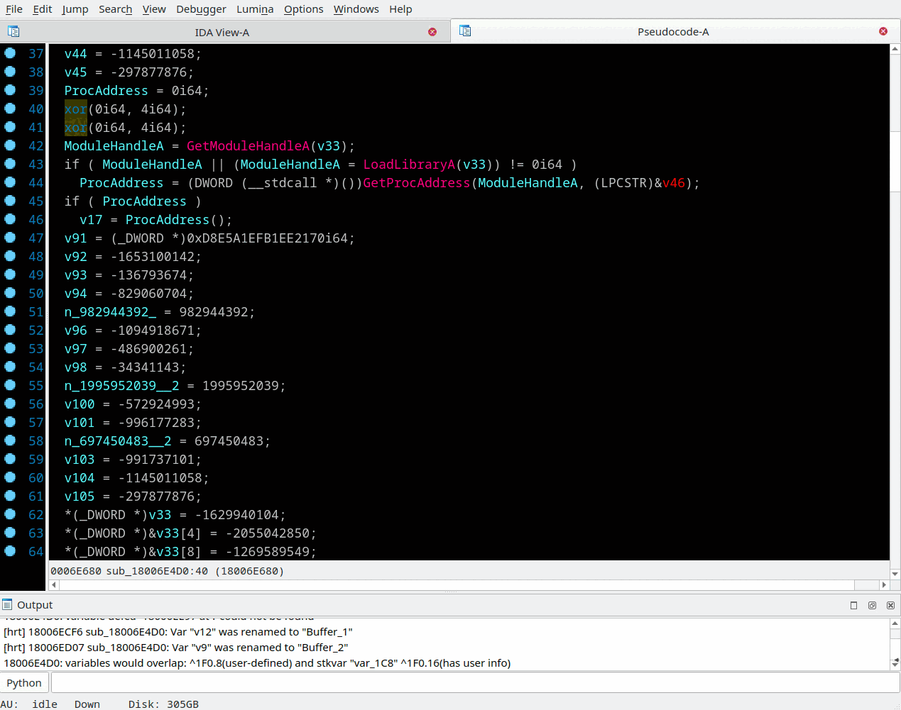
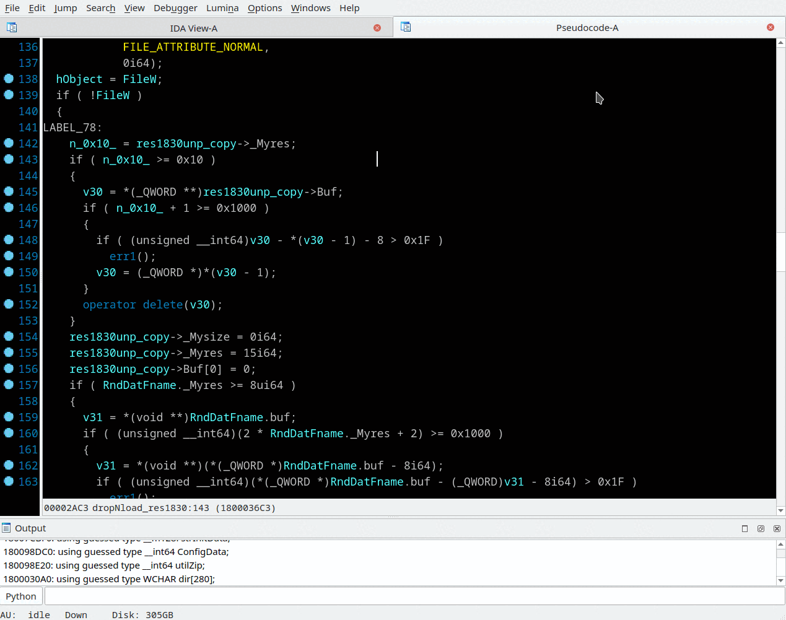
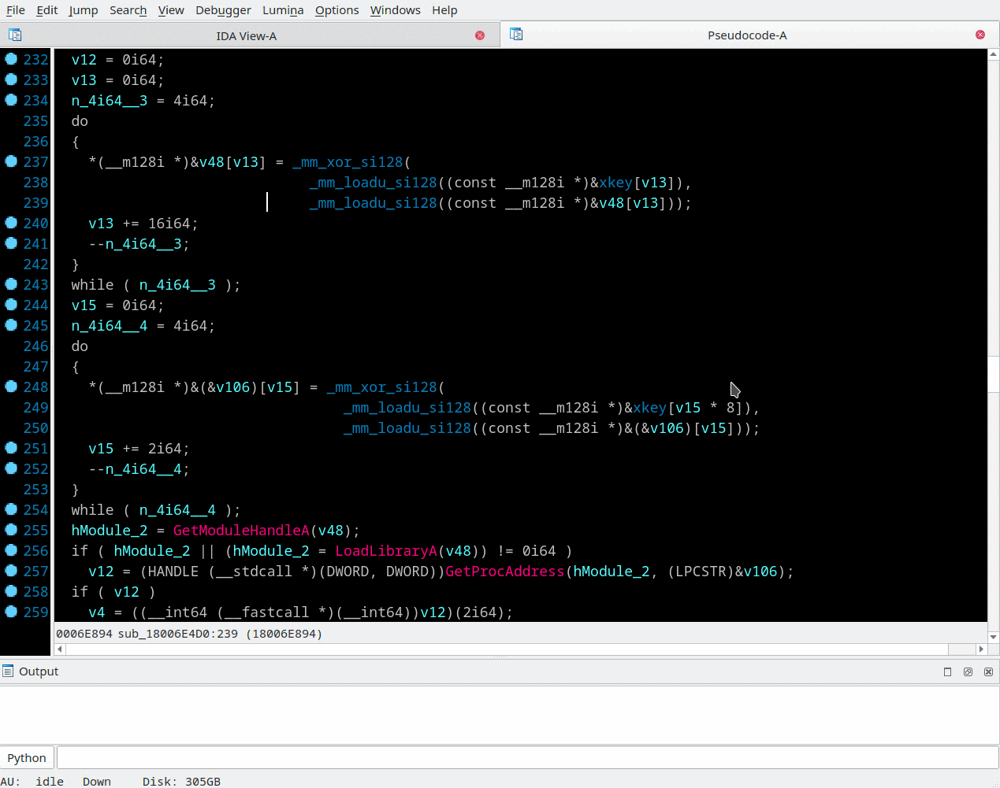
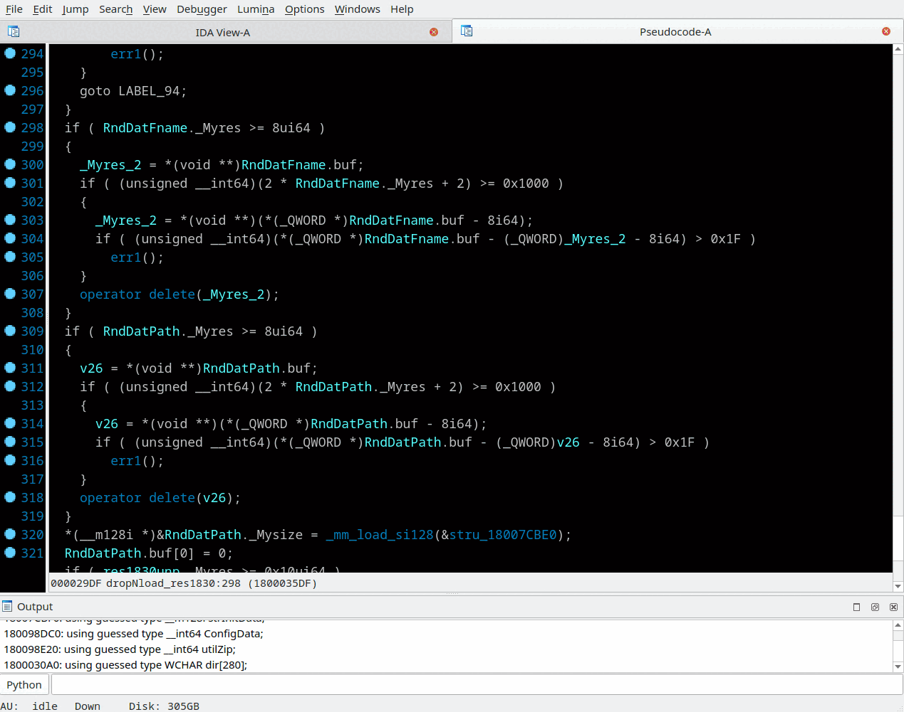

## De-Inline - detection of inlined functions
Context menu *"Enable inlines"*, *"Disable inlines"*, *"Rename inline (N)"*, *"Create 'inline' from grouped nodes"*, *"Create 'inline' from selection"*

This experimental feature is inspired by ideas of [GraphSlick plugin](https://github.com/lallousx86/GraphSlick). Take a brief look at [problem description](https://github.com/nihilus/GraphSlick/raw/master/presentation/Shattering4.pdf). I've decided to implement another vision of the idea.

This implementation is based on comparing blocks by frequency dictionaries of Hex-Rays highly optimized micro-code and blocks relations. Such way is not sensitive to processor architecture, nor instruction ordering, nor even high level language was used - just a pure algorithm is in compare. Algorithm here is a set of high level constructions like arithmetic operations, loops and branches.  
There are still some restrictions: the inlined function should be a quite long to not produce false positives, one long block or few short basic blocks are good enough. And main limitation - inlined function must be aligned to basic blocks boundaries, if it shares some code in the first or last block with surrounding code such inlining will not be detected.

> ⚠️ Features of De-Inliner marked below as ~~strikethrough~~ are switched off as annoying in everyday work. To turn it on set `#define ENABLE_FIND_MATCHED_PATHS 1` in the `deinline.cpp` file of the plugin source code and recompile it.

How does it work:
  - Library-Inlines are loaded from files with "`.inl`" extension in "`$HOME/.idapro/inlines`" or "`%APPDATA%/Hex-Rays/IDA Pro/inlines`" folder at the plugin initialization phase.
  - De-Inliner takes control on latest possible phase of Hex-Rays decompilation when modification of microcode is still allowed and when microcode and control flow graph are well optimized.
  - For each basic block calculated frequency dictionary of microcode instruction opcodes together with their operands. Registers, global and stack variables considered as a same kind of variables. Indirect/direct calls are considered as a same type of calls. For calls makes sense to count arguments as individual instructions.
  - Then Library-Inlines are matched and marked for substitution (more details are below).
  - ~~All blocks are not belong to Library-Inlines compared and sorted into groups of similar blocks. Blocks similarity is depends on number of instructions block is consist, percentage of coverage of smaller block frequency dictionary by larger block, percentage of common instructions.~~
  - ~~For each pair of similar blocks have been found longest possible equivalent subgraphs. To become an Inline the subgraph must fulfill following conditions: to have a single entry where the entry is a part of subgraph, and to have a single exit where the exit block is not a part of subgraph.~~
  - Finally all found Inlines (which is subgraph of matched blocks) cut out from microcode and replaced to "`call inline_name()`" helper.  
   Sometimes, if IDA kindly provide def/use chains, registers and stack variables defined somewhere outside Inline and used inside Inline become Inline arguments. Registers and stack variables defined inside Inline and used somewhere outside Inline become Inline returns.

There ~~are two~~ useful things of De-Inliner technology.
  - ~~Automatically find and visualize multiple instances of equivalent code sequences within single subroutine to simplify understanding of huge functions by enlarging bricks is consists.~~
  - Create a library of algorithms (i.e Inlines) which can be found across different binaries. For example C++ STL functions, encryption algorithms and so on. It may be used like a kind of high level signatures insensitive to platform or compiler was used for low-level code generation.

Inlines are shown in pseudocode like subroutine call.  
~~For example, in automatically generated non-library Inline:~~
```
v10 = inline_5_2_10_11_(v9);
```
~~part of inline name 5,2,10,11 are similar basic blocks group numbers have been matched. Not useful naming, just to see how many blocks this Inline long.~~  
Example of Library Inline representation in pseudocode:
```
crypto.rc4.set_key(ctx, key, keylen);
stl.string.dtor(str);
```

There is no way "to enter" into Inline like into normal procedure call just because inline is integral part of currently decompiled procedure. To see what is hidden under Inline you can hold mouse over an inline call - and approximative contents of inline will be shown as a hint. Inline contents is not stored inside IDA's database and be re-decompiled on a fly as a set of blocks wrested from a context of the procedure.

To see whole procedure without inlines select from context menu - *"Disable inlines"*. *"Enable inlines"* - turn on them back.

To see and navigate to other Inlines with same name within current procedure press "Shift-X" or select menu entry *"Jump/Jump to xref Ex"*

Inlines are just created and not saved yet in the library can be renamed with *"Rename inline (N)"* context menu or with hotkey "N".



There are three ways to create Library-Inline. No one of them is preferred one. On each individual case one may work well when other two are fail:
1) From Graph mode of disassembly view
	- In disassembly view go in Graph mode by pressing "Space" key
	- With Ctrl key and mouse wheel zoom out graph to see the piece of Graph to be Inline
	- With Ctrl key and left click select few nodes (blocks) of Graph.
	- Right click and select *"Group nodes"*, enter name of group.
	- Right click grouped node and select *"Create 'inline' from grouped nodes"*
	- Selections be verified (to be single entry and single exit), and then microcode for the selected blocks is generated.
	- In appeared window you can set name of Inline and see the microcode be used. Confirm it with "OK" or reject Inline creation with "Cancel" button.
	- Check created inline by decompiling current function - press "F5" or select menu *"View/Open subviews/Generate pseudocode"*, your inline should be seen as call in pseudocode.



2) From plain disassembly view
	- In disassembly view select part of subroutine with Shift+Arrows or with Alt-L (menu *"Edit/Begin Selection"*) then right click and select *"Create 'inline' from selection"*
	- Hex-Rays microcode be generated for the selected area
	- In appeared window you can set name of Inline and validate the microcode be used for Inline. Confirm it with "OK" or reject with "Cancel" button.
	- Check created Inline by decompiling current function - press "F5" or select menu *"View/Open subviews/Generate pseudocode"*, your inline should be seen as call in pseudocode.



3) From pseudocode view
	- In pseudocode view select part of subroutine with Shift+Arrows or with Alt-L (menu *"Edit/Begin Selection"*) then right click and select from the context menu *"Create 'inline' from selection"*
	- The plugin align selection to basic block boundaries and forces current subroutine re-decompilation
	- On re-decompilation the plugin tries to create inline from microcode belongs to selected area. Look at "Output window" messages if something went wrong.
	- Do not forget to rename just created Inline before saving database, it was created with name like `inline_40A97C_40AA20` where 40A97C and 40AA20 are addresses of selected range.



Inlines Library is a folders hierarchy located in IDA's profile: "`~/.idapro/inlines`" in Linux and MacOS, "`C:\Users\%user%\AppData\Roaming\Hex-Rays\IDA Pro\inlines`" in Windows.  
For example "`~/.idapro/inlines/test1/test2/test.inl`" file should be seen in IDA as Inline call "`test1.test2.test();`".  
And reciprocal: if you are creating inline with dots in name: ex "`test1.test2.test`" - the folders hierarchy will be created.  
"`.inl`" file has a binary form but begins from text comment generated on creation - here are MD5 hash of source file and entry-exit addresses this inline has been created.

>📝 **Notes:** 
> - Just created Inline automatically validated - can it be found during decompilation. Inline should be seen as call in pseudocode. Message "inline %name% validated" in IDA's "Output window" confirms Inline is OK and will be saved to the library when IDA saves database - on exit, or by *"File/Save (Ctrl-W)"* menu.
> - Just created Inline has not been saved yet in the library might be renamed with usual "N" hotkey. After saving - inlines can be renamed by renaming files inside library folder.
> - Sometimes you can see Inline call in pseudocode, but there are not *"Disable inlines"*/*"Enable inlines"* appeared in context menu,  please force redecompilation by pressing F5 - *"Disable inlines"* should appears. This happens when Hex-Rays has not decompiled the current function but just took pseudocode from cache, at the same time the plugin believes this window containing pseudocode with inline was closed or switched to another proc without inlines.
