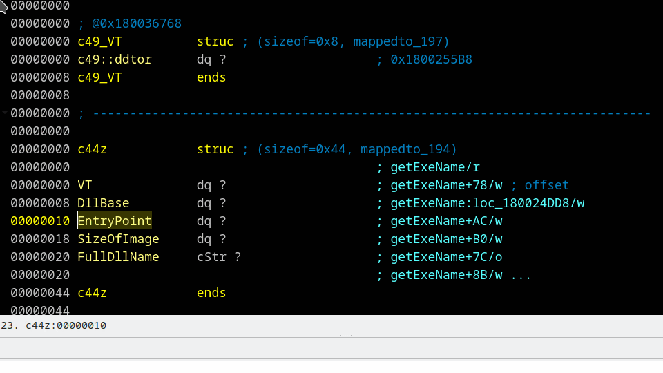

## New functionality in Structures view

> ⚠️ These features are turned off since IDA 9.0 (there is no more "Structures View")

On right click in Structures view.
- *"Extract substruct"* : Select few lines in a structure and it will create a new structure off selected lines.
- *"Unpack substruct"* : Does the opposite of *"Extract substruct"*. It in place unpacks selected structure.
- *"Which struct matches here?"* : Will try to guess which structure has the right offsets and types that can match selected lines in Structures view.
- *"Add VT"* : Adds virtual table to a structure. It asks for address to a virtual table. Then scans vtable for virtual methods and creates VT structure with them and comment like `@0x004047B0`. This enables jumps in Hex-Rays to virtual function by [jump to indirect call destination](ijmp.md)

