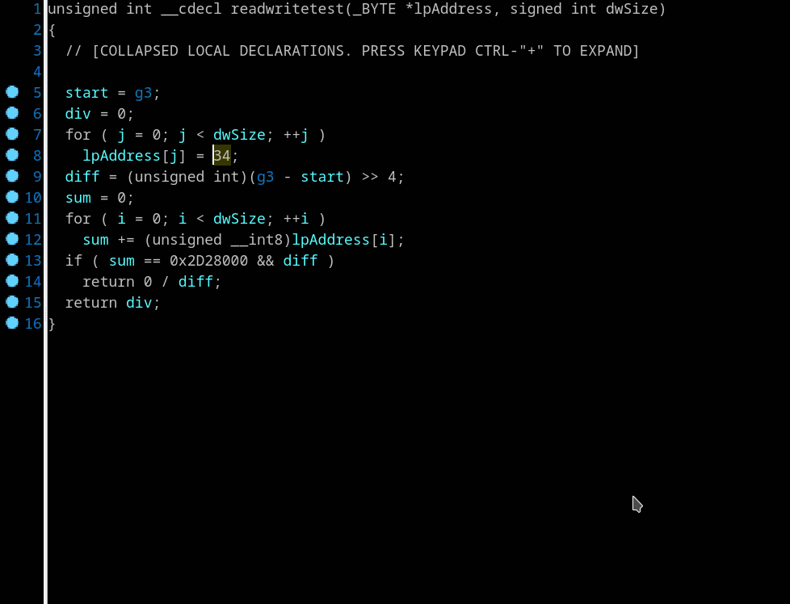

## Hidden variable assignments
Context menu *"Insert variable value assignment..."*, *"Clear variable value assignments"*

This feature is helpful as workaround for unresolved opaque predicates. Hidden assignment looks like a '`mov regOrVar, num`' instruction inserted into specified position during very early decompiling stage.

Right click on register or local variable in pseudocode or disasm view and select *"Insert variable value assignment..."*. Set value be assigned to the variable, verify an address where the assignment will be inserted. New instruction be inserted before any other instruction at specified address.

Assignments are inserted on "Microcode has been generated" event (hxe_microcode). You can see them only in "Microcode" window.  
Comment appears in the first line of pseudocode.
```
// The function is modified by hidden variable assignment(s)
```

You can clear all assignments in the current procedure with context menu *"Clear variable value assingments"*


