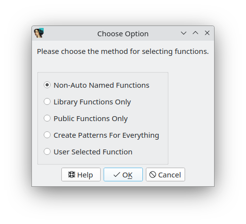

## Create PAT file from IDA database
Menu *"File/Produce file/Create PAT file..."*
> ⚠️ Obsolete since IDA 8.0 has an option to generate FLIRT signatures from the current database. But still available for more flexibility.

[Modifications of original plugin by J.C. Roberts & Alexander Pick](https://github.com/alexander-pick/idb2pat) Ported to current IDA API, 64bit code relative offsets added. Workaround for IDA bug not accepting whole .sig file if one of proc name longer 1023 bytes.

Below the part of original README file.

---
IDB2PAT

- Option: Create patterns for Non-Auto Named Functions

If you find the rare situation where you want to make patterns from functions in an existing database, this option is probably your best bet. It will only create patterns for functions without autogenerated names and it will exclude functions marked as libraries (e.g. they were already found and named through other FLAIR signatures). You may want to remove named functions like _main and WinMain from the resulting pattern file, since these will already exist in the disassembly where it's applied.

- Option: Create Patterns for Library Functions Only

I did include the ability to build patterns for functions IDA has already marked as libraries. This is for people doing source code recovery/recreation since the pattern file can be further parsed to figure out which header files are needed. There are probably better ways to go about this as well but until I have time to write specific a plugin for figuring out which headers are included, this can give you a step in the right direction. Out side of gathering information on applied library signatures, this feature is pointless since you're building patterns for function that were previously found with other signatures you already have.

- Option: Create Patterns for Public Functions Only

This could be useful when dealing with a situation where functions were once stored in a DLL and are now statically linked in an executable. It's still may a better bet to build a signature from the DLL and then apply it to the statically linked executable.

- Option: Create Patterns For Everything

You generally do NOT want to build patterns for every function in the disassembly. The only place where I can see a legitimate use for creating signatures of every function in the database is if your goal is to see how similar two executables are. Instead of using a hex editor and doing a resyncronizing binary compare between the two executables,you could use IDA signatures to get a different/better way to visualize the similarities.

There are a lot of problems with trying to do this. The first and most obvious problem is reserved name prefixes (e.g. sub_) on autogenerated function names. Another cascading problem is of course references to these names withing other functions and whether or not to keep these references in the patterns in order to cut down the number of collisions. There are plenty of other problems with this approach that I won't mention but there are quite a few of them.

I've hacked together a simple work-around. When the user has selected everything mode, the plugin will prepend the autogenerated function names with FAKE_ and references to these sub routines are kept to reduce collisions. This should (in theory) work, since every reference will also have it's own public pattern in the resulting file. In other words, the named references will resolve to another (public) function pattern in the file. The problem with this approach is of course having erroneous address numbers in names of functions where the signature is applied (e.g. the nameFAKE_sub_DEADBEEF could be applied to any address where a matching function is found). My guess why this will work is because a module in a library may have a by name reference to another object in the library. The pattern file of a library would keep the references, since the names are defined in other pattern lines of the file. Of course I could be wrong but it's worth a shot. If need be comment out the "sub_" tests in part #7 (references) of make_pattern() to get rid of the refs.

- Option: Create Pattern For User Selected Function

This allows the user to select a function from the list and create a pattern for it. It does not work on functions with auto generated names but probably could with a bit more work.

LIMITATIONS:
* References and tail bytes are only used by sigmake to resolve collisions. Auto generated names with reserved prefixes "loc_" "byte_" "dword_" are not going to be repeatable in the binary where you would apply the resulting signature. If those references were kept and used to resolve a collision, you'd end up with a useless signature that would not be applied because those names do not exist in executable where the resulting signature is being applied.
* Reference offsets that greater than 0x8000 bytes from the function start may make this plugin explode or more likely, just make unusable patterns.
