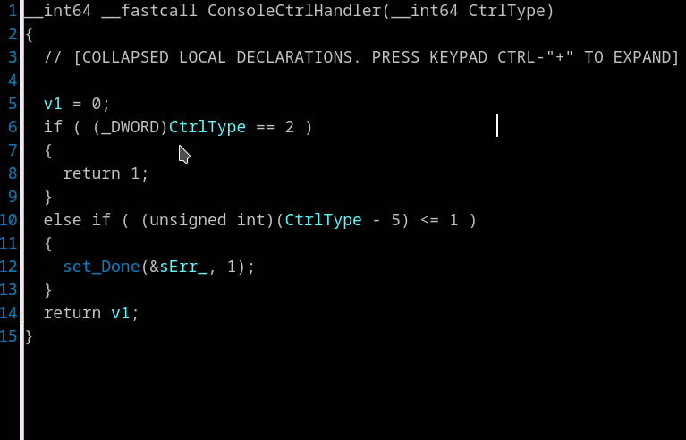

## Invert "if" statement
For example, a statement like
```
    if ( cond )
    {
      statements1;
    }
    else
    {
      statements2;
    }
```
Right click on 'if' and select *"Invert if-statement"*.  The code will be displayed as:
```
    if ( !cond )
    {
      statements2;
    }
    else
    {
      statements1;
    }
```


