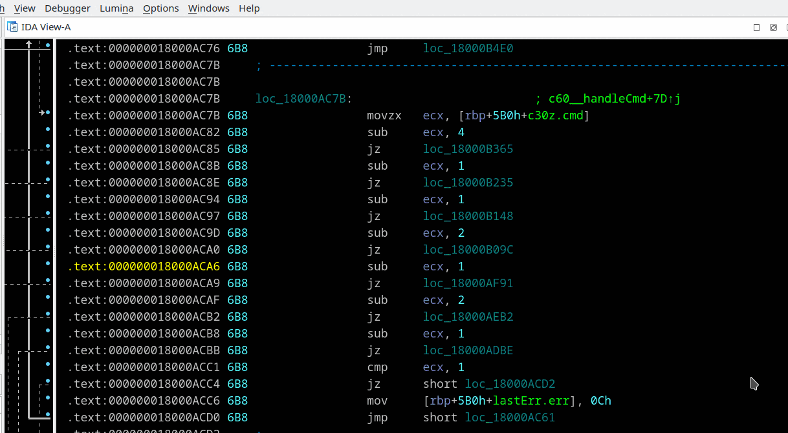

## Microcode Explorer
Menu *"View/Open subviews/Microcode Explorer..."*

Based on a code of [HexRaysDeob](https://github.com/RolfRolles/HexRaysDeob) by Rolf Rolles.

Added navigation with double-click, 'Enter' or 'G' hotkey on block number. 'Esc' key for returning back, that works with IDA 7.4 and later.

