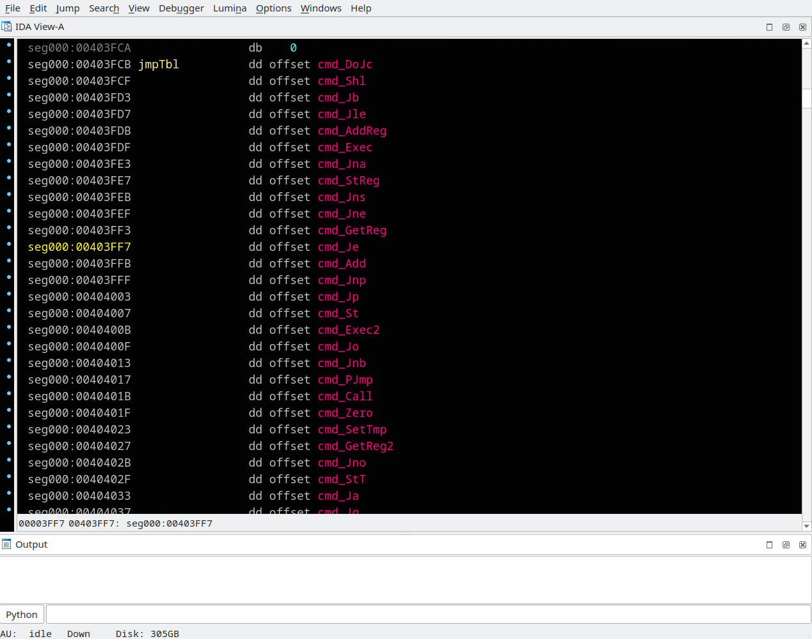
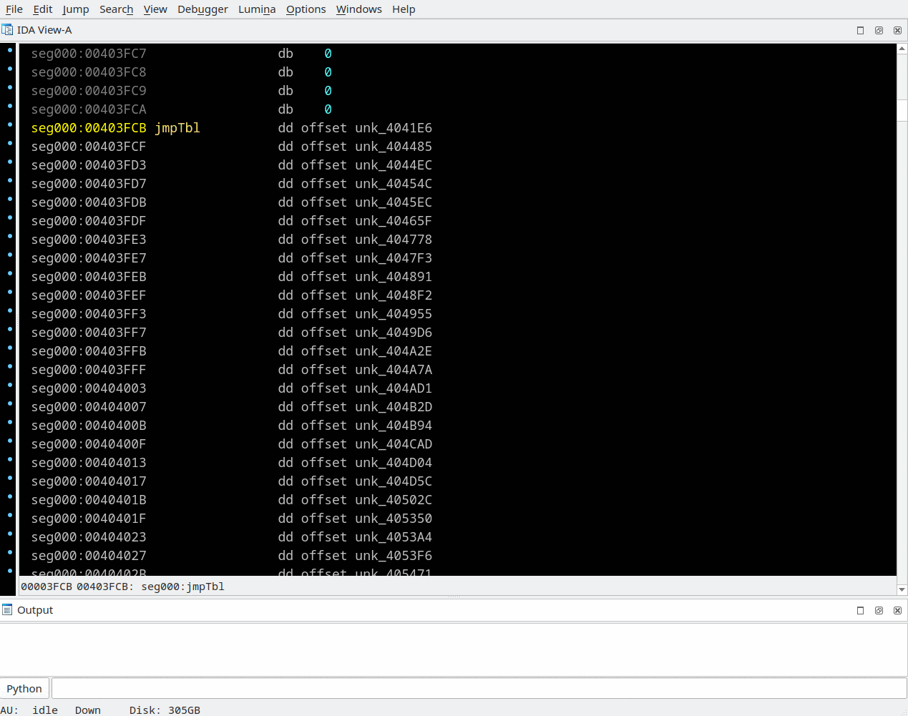

## Microcode signatures (MSIG)
Context menu *"Create MSIG for the function"*, *"Edit MSIG (E)"*, *"Accept MSIG (A)"*  
Menu *"File/Produce file/Create MSIG file..."*, *"File/Load file/MSIG file..."*

Ida's flirt signatures depends a lot on a processor architecture and fails on an obfuscated code. Microcode signatures have no such limitation. It is applied on microcode during latest decompilation stage, when obfuscations possible gone.

MSIGs can be created in "one by one" mode with selecting *"Create MSIG for the function"* in pseudocode context menu and then save them all by menu *"File/Produce file/Create MSIG file..."*. 

There are options of the "Create MSIG file" dialog:
 * All user named functions - functions will be re-decompiled for MSIG generation and MSIGs saved including those manually added
 * Manually selected functions - there is no re-decompilation, currently loaded (and probably edited) and manually added MSIGs saved
 * Minimal signature lenghth - is a minimal length in bytes of the procedure body, and the same time a minimal length on microcode is used to build signature. This value is also used for a manual signature creation.


>📝 **Notes:** 
> - MSIG file is an editable text file where each line is MD5 hash of the function microcode and the signature name.
> - There are possible multiple names for a one signature because of the same microcode was generated for different functions.
> - It's recommended to look into just created MSIG file and consider deleting some of longest lines because they can be a reason of annoying false positives
> - For a procedure has at least one call statement inside in addition to regular 'Strict' signature, one more, so called 'Relaxed' signature is created. Relaxed signature is marked by letter 'r' before the name.
> - In Relaxed mode call's arguments, operands size, resizing instructions and the return statement are ignored. Matching a Relaxed signature is not the 100% reason to rename recognized proc, but just a hint showing similarity.

Load signatures with *"File/Load file/MSIG file..."* Multiple `.msig` files may be loaded. Last loaded MSIG filename is stored in database and will be used to auto-load MSIG on next IDB opening, and auto-save edited MSIGs on IDB saving.

**The following workflow is recommended for effective using MSIGs:**
1) On well reversed IDB:
  - [Import user named functions prototypes into the local type library](import_unf_types.md)
  - Export type info as *"Create C header file"* or *"Dump typeinfo to IDC file"*
  - *"Create MSIG file"* with *"All user named functions"* option is turned on
2) On new IDB:
  - Ensure standard type libraries are loaded (Shift-F11)
  - Load type info was generated for well reversed IDB on step #1 by *"Parse C header file"* or execute *"Script file"*. Be aware it probably required to edit `.h` file to resolve errors on types importing.
  - *"Load MSIG file"* was generated on step #1
  - Run a few times [Recursively decompile callees](recur-decomp.md) on a binary's entry point procedures.

The comment is appeared it the first pseudocode line when a matching signature has been found. And the procedure will be renamed (and recasted if the typelibrary has function declaration with the same name) in case of 'Strict' signature matching, but a new name appears just after repeating `F5` key press.
```
// The function matches msig: msig_name. Press F5 to refresh pseudocode.
```

For a matched 'Relaxed' signature or a signature with multiple names, the proc will not be auto-renamed
```
// The function matches msig: r msig_nameX msig_nameY msig_nameZ
```
Double click or right click to one of signature names and select *"Accept MSIG"* (or press "A" key) to accept the correct proc name.  
Or select *"Edit MSIG"* (or press "E" key) to:
 * remove duplicate names
 * delete the signature by set empty name
 * force to use Relaxed signature like a Strict for matched proc auto-renaming, by removing "r " prefix in the name beginning

After editing all loaded MSIGs will be auto-saved on IDB saving to the last-loaded MSIG file.

---




