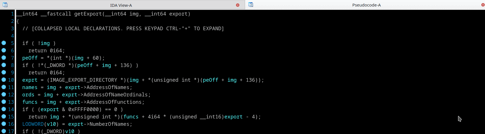

## Automatic offsetof to typecast converter
```
    // Converts construction like
    *(WORD*)(imgbase + offsetof(IMAGE_DOS_HEADER, e_lfanew))
    // to
    ((IMAGE_DOS_HEADER *)imgbase)->e_lfanew
```
Magic conversion `imgbase[15]` or `*((_DWORD *)imgbase + 15)` to temporary `offsetof()` and then to `((IMAGE_DOS_HEADER *)imgbase)->e_lfanew` may be done by pressing `T` hotkey or menu *"Edit->OperandType->Offset->OffsetStruct"* and select appropriate type in disasm on instruction like
```
    mov     eax, [edx+3Ch]
```


