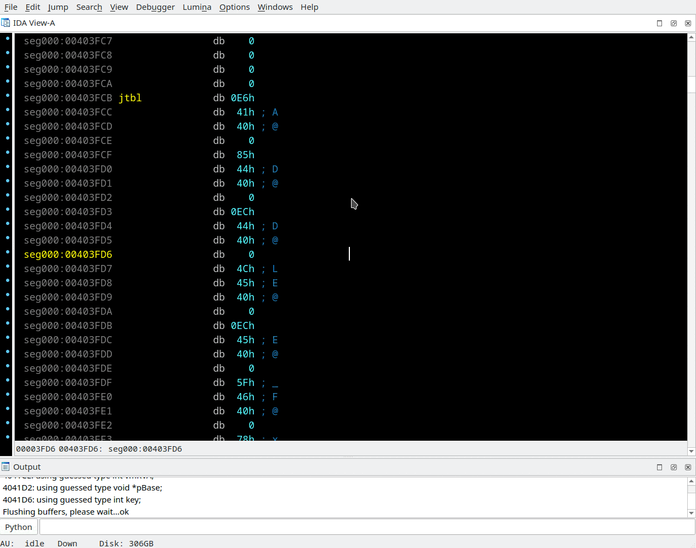

## Offsets table creation
Menu *"Edit/Operand type/Offset/Offsets table (Shift+S)"*

Sometimes IDA does not recognize array of offsets, and user should spend time to type "O" then "arrow down" again and again. In such case you may set cursor on the first member of array and press "Shift-O" or select menu entry *"Edit/Operand type/Offset/Offsets table"* - the plugin will scan the data is it can be offsets and convert it.

