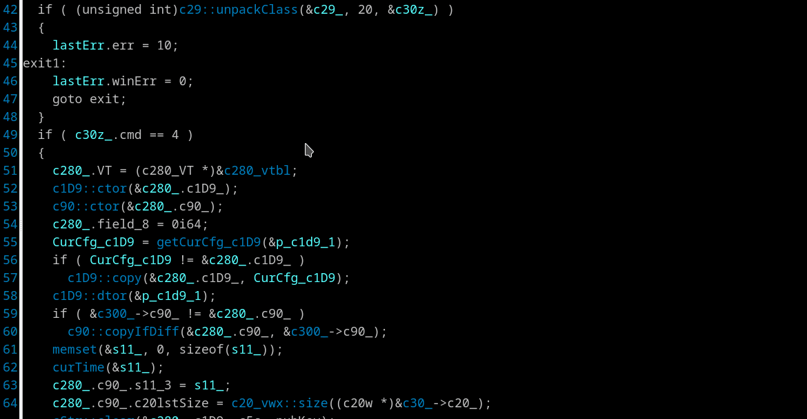

## Pull up comments from disasm to pseudocode view
Researchers and 3rd party IDA plugins often write comments in the disassembly view. The plugin automatically duplicates these comments into pseudocode view. The comment have to be "repeatable" and don't begins with additional ';' symbol. IDA generated auto-comments are filtered out.

Non constant strings placed in writable segment which Hex-Rays display as just a global variable are duplicated as comment with string contents.

