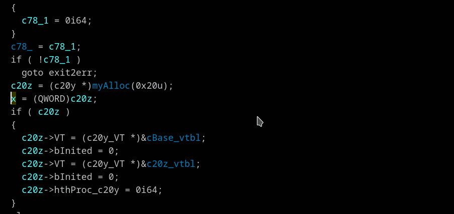

## Assists with changing type of structure member or local/global variable
Context menu *"Recast item (R)"*

Imagine you have pseudocode like this:
```
{
  type1 v1;
  type2 v2
  v2 = (type2)v1;
}
```
Right click on "v2" in the assignment statement and choose *"Recast item"* -- v2 will be converted to type "type1";  
Right click on "v1" in the assignment statement and choose *"Recast item"* -- v1 will be converted to type "type2";

This operation available for a structure's members, local and global variables in the left side of assignment, after C-style typecast inside any expression, in pointer dereference expressions like `*(_OWORD *)var` and in argument of helper calls like `BYTE(v1)`, `LOBYTE, BYTE1, BYTE2, BYTE??, HIBYTE, ??WORD?, ??DWORD?, QWORD`


