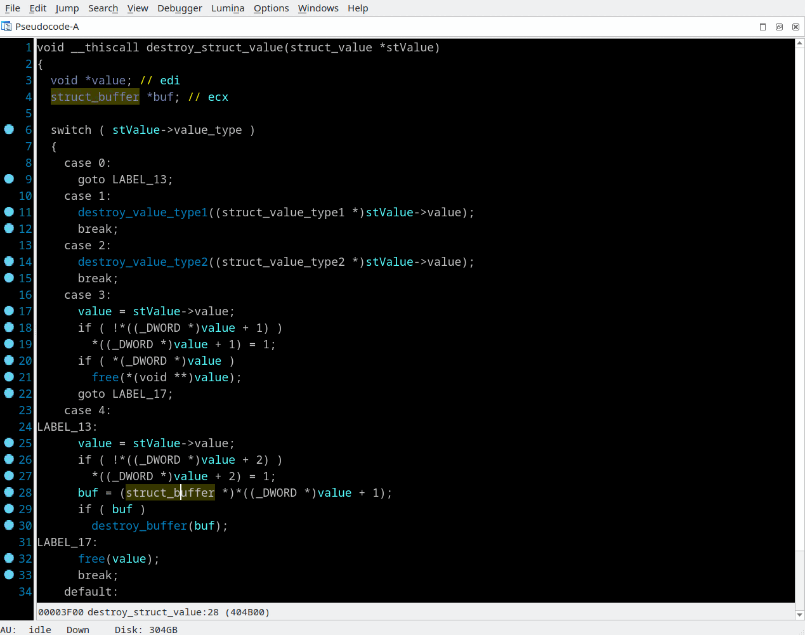

## reinterpret_cast
Context menu *"reinterpret_cast... (I)"* and *"Remove reinterpret_cast (I)"*

For expressions like: "`x + n`", "`x[n]`", "`x->member`", "`*x`" where `x` is any sub-expression and `n` is a number, you may temporary, without changing variable type, force reinterpret typecast of `x` subexpression. Just press "I" and select appropriate structure pointer type of `x` sub-expression. The expression will be replaced to `(reinterpret_cast<struct*>x)->struc_member`

This trick may be helpful in following cases:
 - reinterpret_cast was used in original source code
 - optimizing compiler reuses local variable with different types
 - to select right class's virtual table structure for inherited class's virtual call

For example, below is the procedure uses different types of `stValue->value` depending on a case of switch statement:
```
void __thiscall destroy_struct_value(struct_value *stValue)
{
  struct_value *stValue_1; // esi
  void *value; // edi
  struct_buffer *buf; // ecx
 
  stValue_1 = stValue;
  switch ( stValue->value_type )
  {
    case 0:
      goto LABEL_13;
    case 1:
      destroy_value_type_1((struct_value_type1 *)stValue->value);
      break;
    case 2:
      destroy_value_type_2((struct_value_type2 *)stValue->value);
      break;
    case 3:
      value = stValue->value;
      if ( !*((_DWORD *)value + 1) )
        *((_DWORD *)value + 1) = 1;
      if ( *(_DWORD *)value )
        free(*(void **)value);
      goto LABEL_17;
    default:
      if ( stValue->value_type != 4 )
        exit(1);
LABEL_13:
      value = stValue->value;
      if ( !*((_DWORD *)value + 2) )
        *((_DWORD *)value + 2) = 1;
      buf = (struct_buffer *)*((_DWORD *)value + 1);
      if ( buf )
        destroy_buffer(buf);
LABEL_17:
      free(value);
      break;
  }
  free(stValue_1);
}
```
After applying reinterpret_casts:
```
void __thiscall destroy_struct_value(struct_value *stValue)
{
  struct_value *stValue_1; // esi
  void *value; // edi
  struct_buffer *buf; // ecx
 
  stValue_1 = stValue;
  switch ( stValue->value_type )
  {
    case 0:
      goto LABEL_13;
    case 1:
      destroy_value_type_1((struct_value_type1 *)stValue->value);
      break;
    case 2:
      destroy_value_type_2((struct_value_type2 *)stValue->value);
      break;
    case 3:
      value = stValue->value;
      if ( !reinterpret_cast<struct_value_type3*>(value)->empty )
        reinterpret_cast<struct_value_type3*>(value)->empty = 1;
      if ( reinterpret_cast<struct_value_type3*>(value)->allocated_buffer )
        free(reinterpret_cast<struct_value_type3*>(value)->allocated_buffer);
      goto LABEL_17;
    default:
      if ( stValue->value_type != 4 )
        exit(1);
LABEL_13:
      value = stValue->value;
      if ( !reinterpret_cast<struct_value_type4*>(value)->empty )
        reinterpret_cast<struct_value_type4*>(value)->empty = 1;
      buf = reinterpret_cast<struct_value_type4*>(value)->buf;
      if ( buf )
        destroy_buffer(buf);
LABEL_17:
      free(value);
      break;
  }
  free(stValue_1);
}
```


