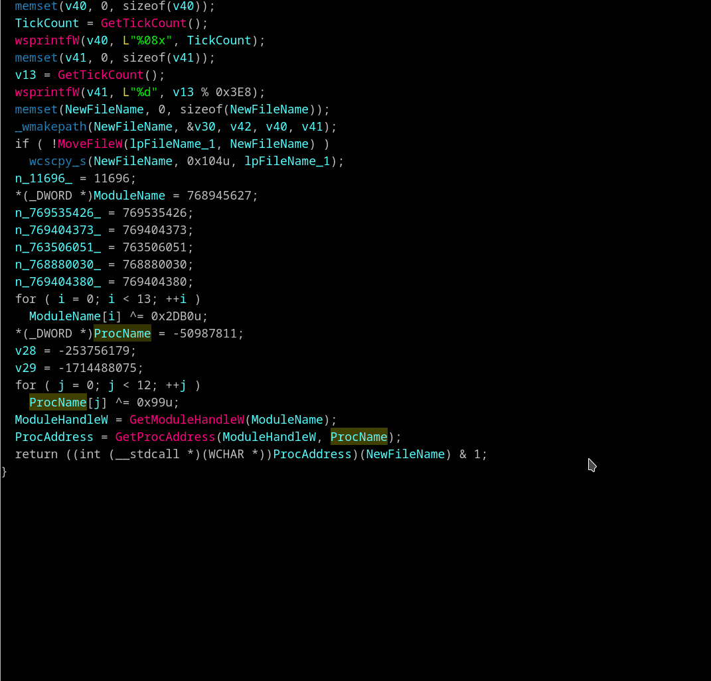
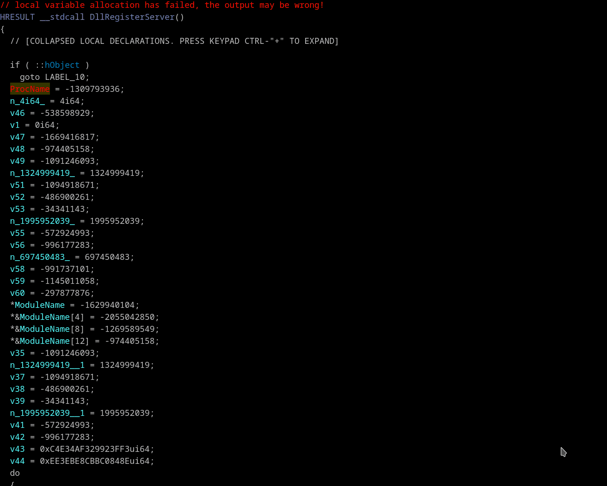
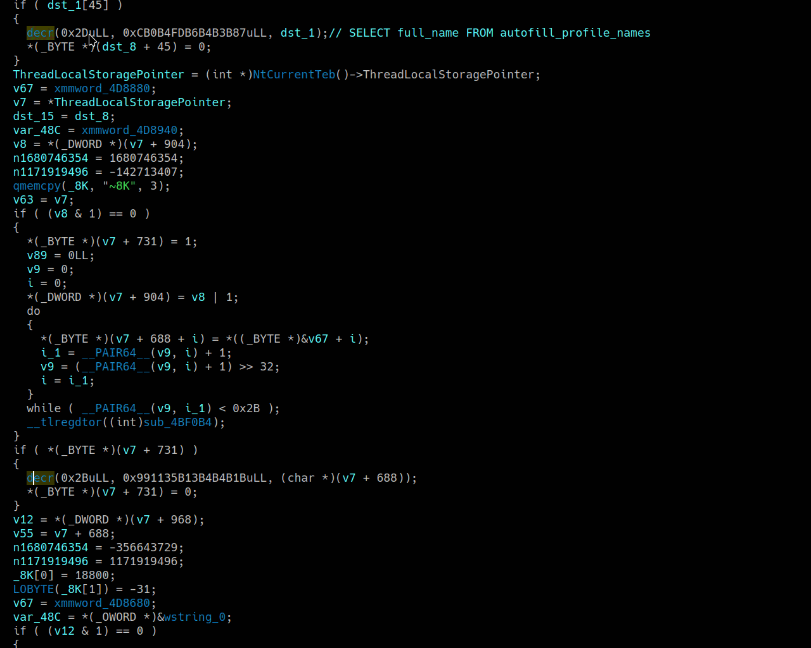

## Build stack strings (optionally with decryption)
Context menu *"Build stack string (B)"*, *"Build stack string and decrypt (Shift-B)"*

Simple example for beginning. Imagine code like this:
```
    Str2 = 115;
    v72 = 101;
    v73 = 114;
    v74 = 118;
    v75 = 105;
    v76 = 99;
    v77 = 101;
    v78 = 115;
    v79 = 46;
    v80 = 101;
    v81 = 120;
    v82 = 101;
    v83 = 0;
    if (wcsicmp(&Filename, &Str2))
```
Right click on first assignment `Str2` variable and select *"Build stack string"* or *"Build stack string and decrypt"*. Select encryption algorithm if need. You are might be asked for char size if plugin can't determine size automatically. The code will be converted to the following form:
```
    services.exe[0] = 's'; // services.exe
    services.exe[1] = 'e';
    services.exe[2] = 'r';
    services.exe[3] = 'v';
    services.exe[4] = 'i';
    services.exe[5] = 'c';
    services.exe[6] = 'e';
    services.exe[7] = 's';
    services.exe[8] = '.';
    services.exe[9] = 'e';
    services.exe[10] = 'x';
    services.exe[11] = 'e';
    services.exe[12] = 0;
    if ( wcsicmp(&Filename, (const wchar_t *)services.exe) )
```
Modern IDA well recognizes such cases and replace these to the helper call like `wcscpy`. But for the older version that may be still useful.



The second example with decryption string where the same stack location is used for a few different string assignments.
>📝 **Note:** Important to begin this operation from the first assignment to distinguish different strings in the same memory location. On screen cursor position is the strings divider for such case.



In the third example stack string is built from three different types of assignment. There are:
 - assignment of global variable value to the stack variable
 - usual immediate value assignment
 - part of string has been recognized by IDA and converted to `qmemcpy` helper call


