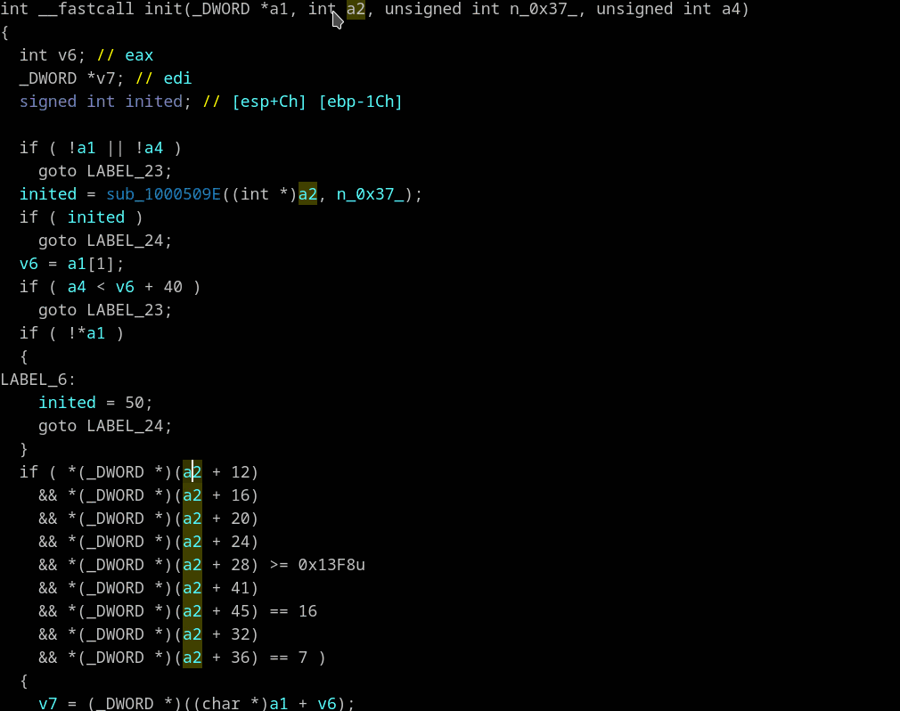

## Assist in creation of new structure definitions
 Context menu: *"Scan variable (S)"*, *"Open structure builder"*, *"Finalize structure"*

1. Use *"Reset pointer type"* on all variables that you want to scan. (Not always works on latest Ida - so use *"Set lvar type (Y)"* and then type *int*)
2. Select one of these variables and choose *"Scan variable"*. Plugin deals with simple assignments like `v1 = this;` automatically.
3. Repeat above two steps in other subroutines where the same type of variable is used. All "Scan" results will be accumulated. Aware mixing different types in sequence scans will mess cumulative result.
4. Again right click on such variable and choose *"Open structure builder"* Adjust the structure as you like.
   * Hotkeys help is in the bottom of widget. Also try right click inside structure builder's widget for additional options.
   * In Structure builder you can open a list of functions you scanned so far and functions that were added from virtual function tables.
   * Open some of the functions and scan other variables that are of the same type.
   * As you gather more evidence structure builder will show you guessed substructure sizes and guessed types.
   * Colliding types have red background. Use "Delete" to solve the ambiguity.
   * All scans info are accumulating until *"Finalize structure"* or *"Clear scan results"*
5. Click on the scanned variable in pseudocode and choose *"Finalize structure"*.
6. You will be given a window with "C" declaration of the new structure that you can tweak by hand and then the new type will by assigned to variables you have scanned.

