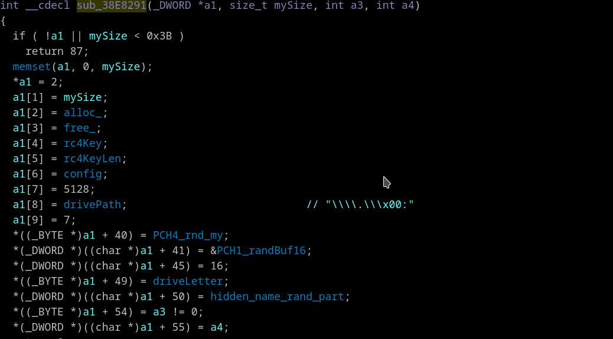

## Assist split gaps in structures
*Context menu "Fix field at struct gap (F)"*

When an "empty" structure member is accessed Hex-Rays shows something like:
```
      *(_DWORD *)&struc_1->fld_gap[12]
       or
      *(_DWORD *)&struc_1->gap0[12]
```
Right click on "gap" word and select "Fix field at struct gap" or just press "F" - the field member at position 0xC with type _DWORD will be created and "fld_gap" fields around - corrected



In the gif above:
* Type of `a1` variable is changed to `s3Bz*` on variable rename by [renaming/retyping assistant](rename-recast.md)
* Just created by pressing "F" key struct fields are immediately renamed by [Auto-renamer](var-auto-rename.md) to the names on a right side of assignments