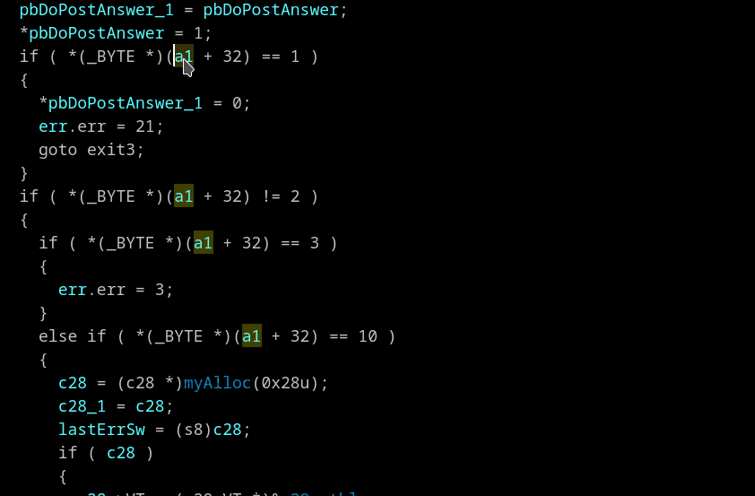

## Find structures with same "shape" as is used / Create struct from derefs
Context menu *"Recognize var type shape (T)"*

Right click on variable and choose *"Recognize var type shape"*. The plugin will show you that the only structures that matches this variable usage shape.

There is also way to quickly create a new struct. Just select the first, `<create new>` line in the chooser's list and editor window with proposed structure definition is appeared.

>📝 **Note:** For better results use *"Reset pointer type"* on a variable before the scan. (Not always works well, more reliable *"Set lvar type (Y)"* and then type *__int64* or *int* according pointer size)

