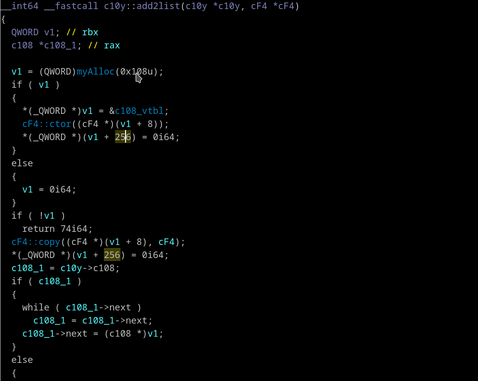

## List structures with given size or offset
Context menu *"Which structs have this size? (S)"*, *"Which structs have this offset? (O)"*

Right clicking on any number in pseudocode view. There are two new items in the context menu appeared:
 - *Which structs have this offset?*
 - *Which structs have this size?*

This will give you list of structures having exact size or member offset (even in substructures)

