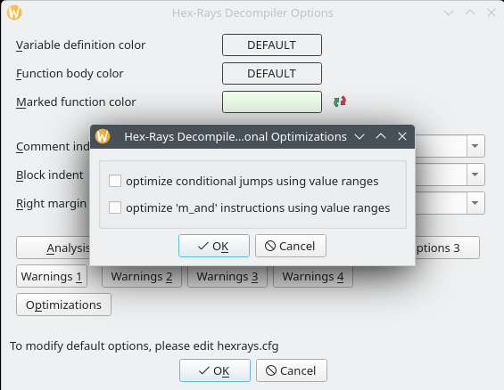
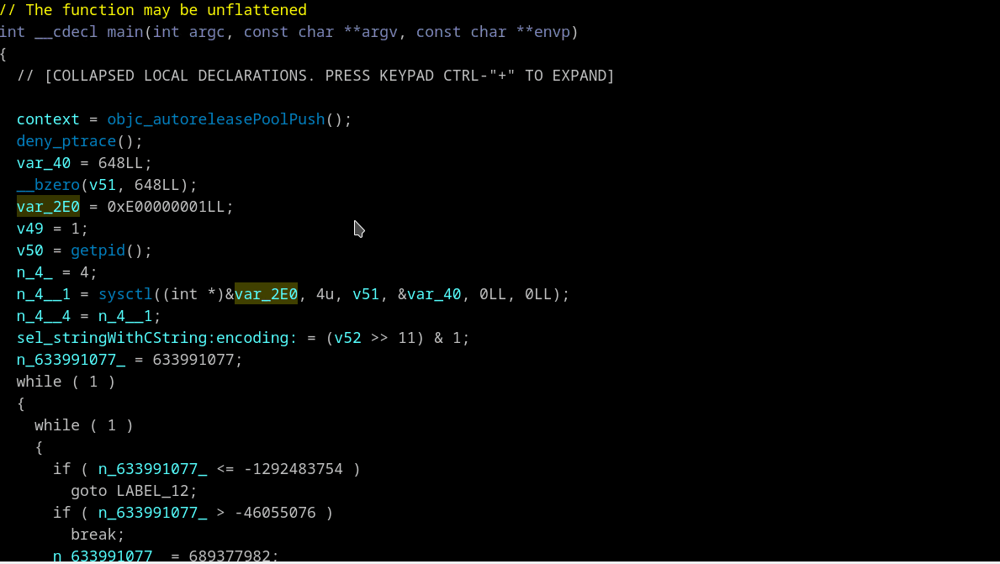

## Unflattening
Here is a deep modification of original code by [Rolf Rolles](https://hex-rays.com/blog/hex-rays-microcode-api-vs-obfuscating-compiler)
and [Takahiro Haruyama](https://blogs.vmware.com/security/2019/02/defeating-compiler-level-obfuscations-used-in-apt10-malware.html)
to deal with nested flattening and jg/jle instead jz/jnz comparing were used in FinSpy (FinFisher) malware.
As well it should be useful in RE other flattened malware.

For better results is recommended to temporary switch off following Hex-Rays decompiler optimizations:
 * *optimize conditional jumps using value ranges*
 * *optimize 'm_and' instructions using value ranges*
 

Unflattener may be disabled/enabled in decompiler's context menu. Current state of unflattener reported in a comment in the first line of pseudocode. 

