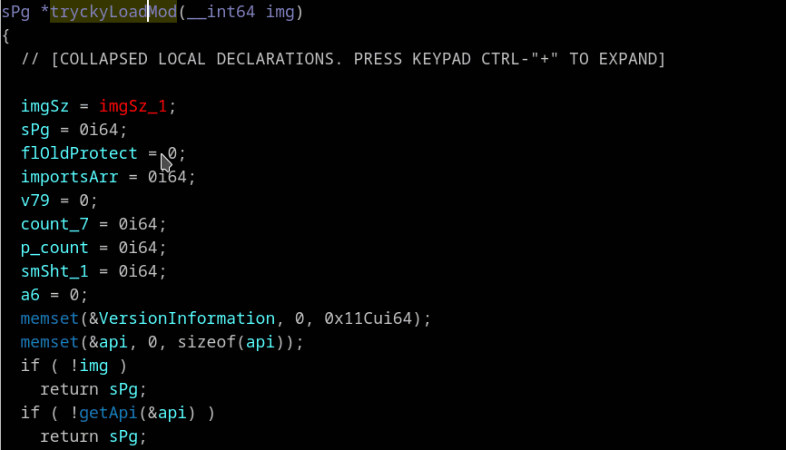

## Convert function to __usercall, detect spoiled registers
Context menu *"Convert to __usercall (U)"*

Binaries that have been compiled with link time global optimization are very liberal with calling conventions.  
Just right click on first line of pseudocode and choose *"Convert to __usercall"*.  
Undefined variables will be converted to function arguments. And spoiled registers are recognized and added to the function type declaration.

