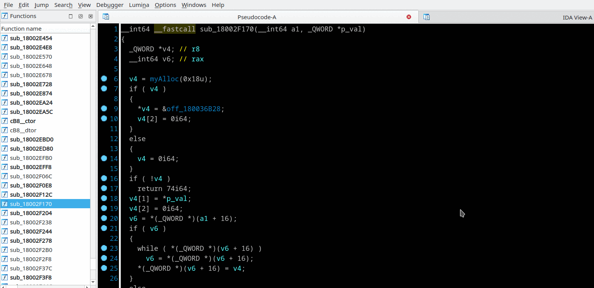
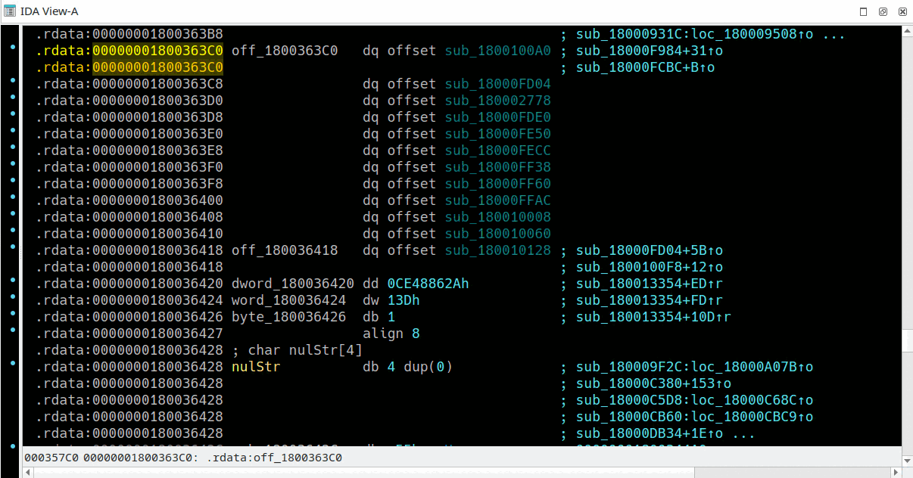

## Virtual calls assists
Context menu *"Add VT"*, *"Add VT struct"*

The plugin automatically creates VTBL structures on a fly during decompilation, when detects VTBL assignment statement. The following limitation works in auto mode:
  * If the VTBL in an assignment statement was already added it will not been checked for VTBL was changed since then
  * Abstract class's VTBL will be ignored if it has any member contains `purecall` sub-string in the name. For the sake of skipping unnecessary union types for vtables. In [recursive decompile](recur-decomp.md) mode uncontrolled selection of a wrong vtable union member may offends right virtual call target search.

Please watch IDA Output window messages for the following common errors may occur:
```
[hrt] 10012345: please check data bytes instead code in vtbl at 100007777
[hrt] 10012345: please check an empty vtbl
[hrt] 10012888: ignore abstract class vtbl in auto-scan mode ("_purecall")
```
You may double click the problem address Output window, fix VTBL then manually add or update it with *"Add VT"* context menu.
As well abstract class vtables may be added manually.

- *"Add VT"* in Pseudocode view: Right click on VTBL assignment statement (usually in constructor and destructor proc) and select *"Add VT"*. VTBL structure be created and tied to vtbl member.  
If vtbl member is already defined:
  * On the same VTBL assingment: the plugin creates a new VTBL structure. It may be useful if previous VTBL structure was incomplete.
  * On the another VTBL: the plugin creates a union type with VTBL structures of the base and derived classes.



- *"Add VT struct"* in IDA View: Right click on beginning of virtual table and select *"Add VT struct"*. VTBL structure be created and Structures view with the structure be opened. You need to manually tie the VTBL struct to an appropriate class's structure member.
 

