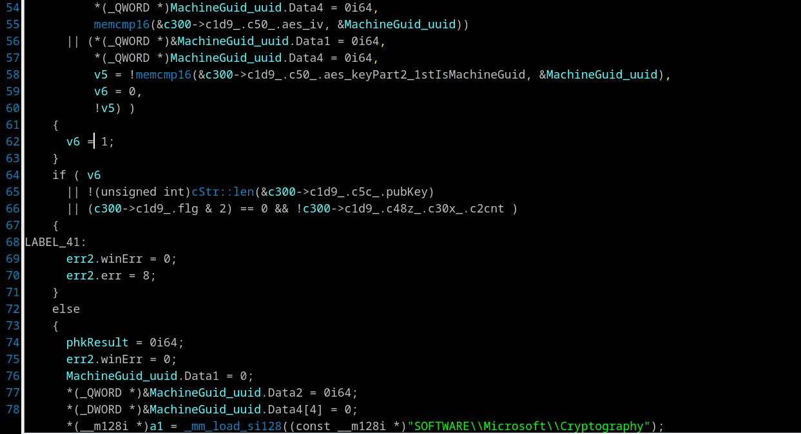

## Extended xrefs
Menu *"Jump/Jump to xref Ex (Shift-X)"*

There are several things on one action/shortcut:
- Shows list of direct references to a register from the current instruction. Press "Shift-X" in IDA-View on register or stack variable to see and navigate to places where the register or variable is used or defined.
- Shows xrefs to the called function or global variable as the decompiler output with the usage context - for example: with the call arguments. Press "Shift-X" in disasm or pseudocode view on call or global variable.
- Same for "helper" calls inside the current procedure in pseudocode view. Useful to watch [Inlines](deinline.md).
- Also a place sensitive wrapper for HexRay's actions: *"Jump to xref globally"*, *"Jump to xref"*, *"Jump to xref to operand..."*

>💡 **Tip:** *"Jump to xref globally"* does not always works correctly if search target has been renamed, because it uses decompilation cache. You may clear all cached decompilation results by pressing "`" hotkey or use menu *"Edit/Other/Clear cached decompilation results"* then do again *"Jump to xref globally"* and "Ctrl-U" to update cache

