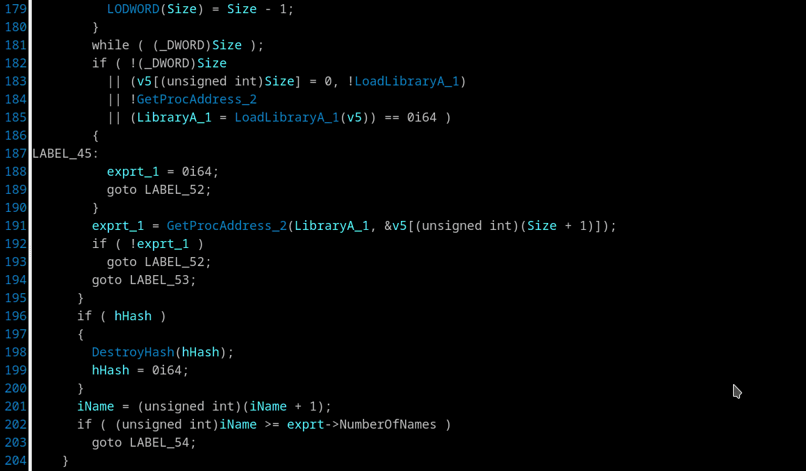

## Get API help
Context menu *"Zeal offline API help (zealdocs.org) (Alt-F1)"*

When cursor is on a call statement press "Alt-F1" or right click and select *"Zeal offline API help"*. The plugin strips "_X" in the end of name called function (where X is a number), removes last A/W character and launch Zeal offline documentation browser for this API.

 - Zeal doc browser for Windows/Linux/MacOS can be downloaded at [zealdocs.org](https://zealdocs.org)
 - Zeal browser executable have to be in PATH.
 - Good offline MSDN docset for Zeal can be downloaded at [www.rotemy.com/dash](https://www.rotemy.com/dash)
 - There is 404 now for "Feed URL" links at https://www.rotemy.com/dash - just replace `http` to `https` in "Feed URL". Right "Feed URL" for MSDN at the moment is `https://rotemy.com/dash/msdn/msdn.xml`
 - If you won't use Zeal or prefer online help you can create shell script (batch file) with name 'zeal' with something like "`firefox https://www.google.com/search?q=$1`" inside. And put this file somewhere in PATH.

